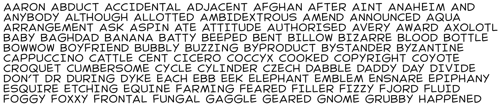

# plotter-text

Generate dynamic single-stroke text in Processing. Save to SVG for clean pen plotter output.



## Getting Started

### Requirements

- [Processing 4](https://processing.org/download/)
- The [ControlP5](https://github.com/sojamo/controlp5) library is required to run the Font Editor sketch.

### Installation

**1. Add the PlotterText class to your project**

Copy the `PlotterText.pde` file from the [`dist`](dist/) folder into the folder for your Processing sketch.

**2. Add the font files**

Copy the entire [`astroTown`](fonts/astroTown/) font folder into your sketch's `data` folder.

If you want to create your own font, you'll need an SVG file for each character and a `data.json` file to specify font coordinates. Use the [Font Editor](examples/FontEditor/) in the [`examples`](examples/) folder to edit character positions and kerning pairs.

### Example Sketch

1. Create an instance of the `PlotterText` class with the path to your font.
2. Use `drawText()` or `drawTextCentered()` to render text to the screen.

```java
PlotterText pt;

void setup() {
	size(300, 200);
	pt = new PlotterText("fonts/astroTown/", 20);
}

void draw() {
	background(255);
	pt.drawText("Hello world!", 10, 10);
}

```

## Usage

### Instantiation

_PlotterText_ **new PlotterText**( _String_ fontPath, [ _float_ size ] )

Create an instance of the PlotterText class.  
`fontPath` specifies the location of your font's folder (relative to your sketch's `data` folder).
`size` is the desired display size in pixels.

### Drawing Text

_void_ **drawText**( _String_ text, [ _float_ x, _float_ y ] )

Draw text to the screen.  
`x` and `y` specify the position of the top left of the text.

_void_ **drawTextCentered**( _String_ text, [ _float_ x, _float_ y ] )

Draw text to the screen, horizontally centered.
`x` and `y` specify the position of the top center of the text.

### Font Properties

_float_ **letterSpacing**

The amount of additional space to add between each letter.  
Expressed as a percentage of the character size.

_float_ **lineHeight**

The amount of vertical space given to each line in multiline text.  
Expressed as a percentage of the character size.

_float_ **spaceWidth**

The width of a space character.  
Expressed as a percentage of the character size.

_void_ **setSize**( _float_ size )

Set the display height of your font. Change this in between calls to `drawText` to create text of different sizes.

### Utility

_float_ **getStringWidth**( _String_ text )

Calculate the width of a string using your font at its current size without drawing to the screen.

### Modify and Save

Additional methods are available to modify font data and save it to disk.  
Check [`PlotterText.pde`](src/PlotterText.pde) for details.

## Saving to SVG

The SVG library makes it possible to write SVG files directly from Processing.
Any PlotterText drawn to the screen while saving will be added to the exported SVG.

### Example sketch:

```java
import processing.svg.*;

PlotterText pt;

void setup() {
	size(400, 400);
	pt = new PlotterText("fonts/astroTown", 12);
	noLoop();
}

void draw() {
	beginRecord(SVG, "filename.svg");

	// draw some text
	pt.drawText("Hello world", 10, 10);

	// other vector drawing
	line(0, 0, width/2, height);

	endRecord();
}
```

For more examples, see the [SVG Export](https://processing.org/reference/libraries/svg/index.html) page on the Processing site.

## Build from Source

The build script for this project (`build.sh`) simply copies the classes from `src` into a single file in the `dist` folder.

```zsh
cd [plotter-text]
./build.sh
```

## Support

This is a personal project and is mostly unsupported, but I'm happy to hear feedback or answer questions.

## License

This project is licensed under the Unlicense - see the [LICENSE](LICENSE) file for details.

---

👨🏻‍🦲❤️🛠
